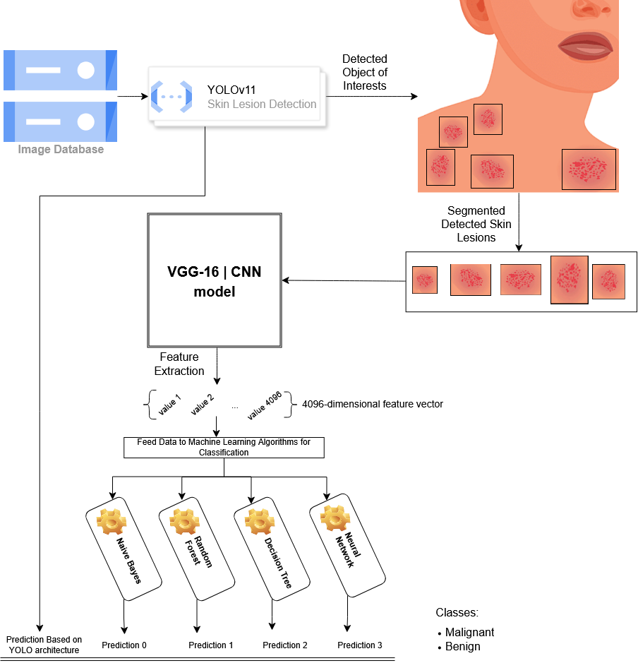
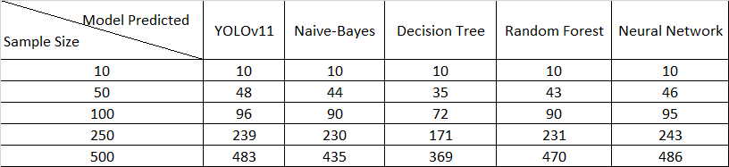
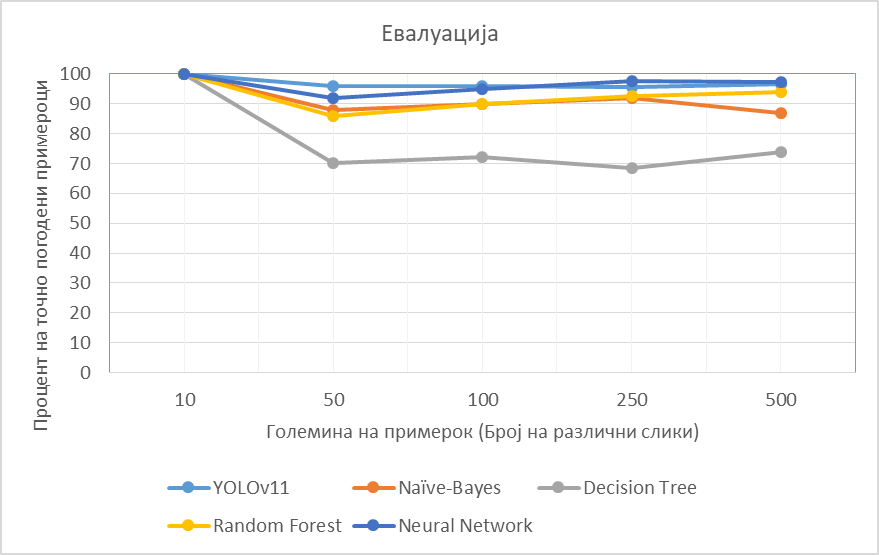
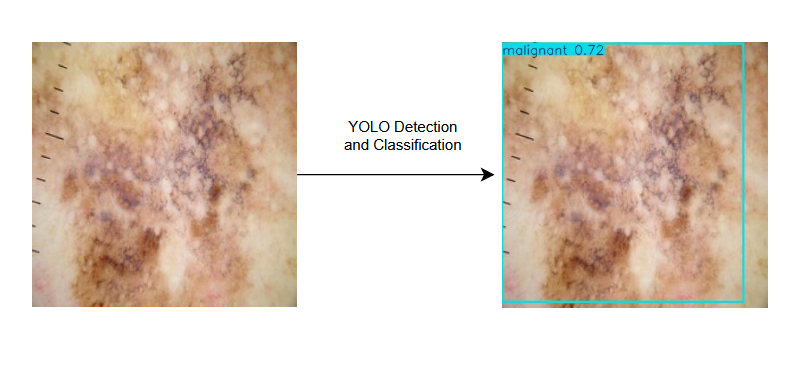
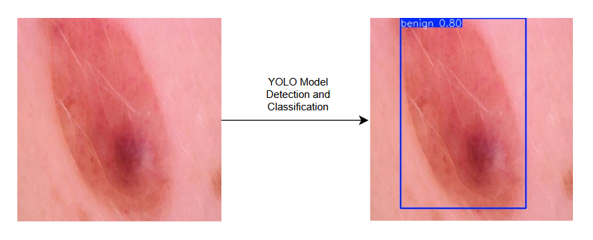

# Skin Diagnosis - AI

Целта на овој проект пред се е да обезбеди систем за детекција, а понатаму за класификација на кожни заболувања, со посебен фокус на разликување/идентификација помеѓу бенигни и малигни форми на рак, базирано на модели од вештачка интелигенција и машинско учење. Меѓутоа, точното идентификување дали кожното заболување e бенигно или малигно, претставува предизвик, токму поради суптилните разлики помеѓу различните типови на кожни болести. Овој проект не претставува само автоматизација на процесот на детекција, туку и обезбедува поточно и сигурно класифицирање преку интеграција на повеќе модели од вештачка интелигенција.
## Опис

Иницијално искорисена е YOLO архитектурата која се заснова на длабоки наверонски мрежи, која прави селекција на области на самата слика, пришто се обидува да издвојува објекти од интерес каде се среќаваат идентични карактеристики како оние врз кој е трениран моделот и притоа прави класификација на истите согласно сличностите и одликите на соодветните класи од тестирачкото множество слики. Моделот користи алгоритам за детекција на потенцијални области на загриженост каде може да постои опасност од болест на самата кожата, меѓутоа поради тоа што различни болести често изгледаат многу слично, имаат слична боја, облик, изразитост или распространетост, самата детекција не е доволна за сигурно класифицирање на состојбата. При тестирање со YOLO архитектурата увидено е дека, иако моделот доста добро знае да ја воочи областа на загриженост, често знае да погреши при самата класификација, поради горенаведените причини.

Поради тоа, за поконкретна и точна класификација имплементирани се дополнителни алгоритми од машинско учење, класификатори, со чија помош се зголемува точноста при идентификација кон која од класите (бенигни или малигни заболувања) припаѓаат детектираните форми од сликата, односно категоризација. Станува збор за алгоритмите: Naive Bayes, Random Forest, Decision Tree, Neural Network класификатори од библиотеката sklearn.

Извлекување на карактеристики/обележја со кои се тренираат горенаведените модели, се изведува со помош на VGG16 модел базиран на CNN (convolutional neural network) кој екстрахира, т.е извлекува карактеристики кои ги опфаќаат значителните визуелни шаблони и структури, што е од клучно значење за разликување помеѓу бенигни и малигни заболувања. Некои од спецификациите кои моделот ги согледува при извлекување обележја се: Color Gradients, Corners, Shapes Patterns, Texture Patterns, Edges, Lines, Smoothness, Structure.

## Илустрација на архитектура

Во продолжение е претставен дијаграм кој сликовито ја опишува гореспоменатата идејна архитектура која е обработена во склоп на овој проект.

## Податочно множество

This project utilizes the "Skin Cancer Dataset" (Arshad, 2022), available on Roboflow Universe. The dataset consists of 1000 images of various skin conditions, categorized into two groups for training machine learning and computer vision models:

    Benign
    Malignant
    
[Link to Dataset](https://universe.roboflow.com/arshad-rv7jf/skincancer-kcuu6)

## Валидација на Алгоритмите 

За да согледаме точноста и исправности на наведените алгоритми со кои се прави детекција и класификација, се користат неколку метрики од библиотеката sklearn, и тоа: accuracy_score, average_precision_score, classification_report. Овие метрики овозможуваат анализа на перформансите и ефикасноста на искористените модели при самиот проект.

### **Precision**
The proportion of true positives out of all positive predictions:
`Precision = True Positives / (True Positives + False Positives)`

### **Recall (Sensitivity)**
The proportion of actual positives correctly identified:
`Recall = True Positives / (True Positives + False Negatives)`

### **F1-Score**
The harmonic mean of precision and recall:
`F1-Score = 2 * (Precision * Recall) / (Precision + Recall)`

### **Accuracy**
The proportion of correctly classified samples:
`Accuracy = (True Positives + True Negatives) / (Total Samples)`

### **Average Precision**
The average precision is the weighted mean of precision across all recall levels:
`AP = Σ (Recall Change * Precision at that Recall)`

#### YOLOv11 Model

| **Metric**                     | **Benign**   | **Malignant** | **Overall (All Classes)** |
|---------------------------------|--------------|---------------|---------------------------|
| **Precision (P)**               | 0.938        | 0.821         | 0.880                     |
| **Recall (R)**                  | 0.901        | 0.767         | 0.834                     |
| **mAP50 (IoU = 0.5)**           | 0.955        | 0.837         | 0.896                     |
| **mAP50-95 (IoU 0.5 to 0.95)**  | 0.627        | 0.432         | 0.529    

#### Naive Bayes Classifier

| Class | Precision | Recall | F1-Score | Support |
|-------|-----------|--------|----------|---------|
| **Benign**| 0.79      | 0.85   | 0.82     | 100     |
| **Malignant**| 0.84      | 0.78   | 0.81     | 103     |
| **Accuracy** |           |        | **0.81** | **203** |
| **Macro avg** | 0.81      | 0.81   | 0.81     | 203     |
| **Weighted avg** | 0.81    | 0.81   | 0.81     | 203     |

**Accuracy:** 0.8128  
**Average Precision:** 0.77

#### Decision Tree Learning

| Class | Precision | Recall | F1-Score | Support |
|-------|-----------|--------|----------|---------|
| **Benign**| 0.88      | 0.65   | 0.75     | 100     |
| **Malignant**| 0.73      | 0.91   | 0.81     | 103     |
| **Accuracy** |           |        | **0.78** | **203** |
| **Macro avg** | 0.80      | 0.78   | 0.78     | 203     |
| **Weighted avg** | 0.80    | 0.78   | 0.78     | 203     |

**Accuracy:** 0.78  
**Average Precision:** 0.71

#### Random Forest Classifier

| Class | Precision | Recall | F1-Score | Support |
|-------|-----------|--------|----------|---------|
| **Benign**| 0.88      | 0.85   | 0.86     | 100     |
| **Malignant**| 0.86      | 0.88   | 0.87     | 103     |
| **Accuracy** |           |        | **0.87** | **203** |
| **Macro avg** | 0.87      | 0.87   | 0.87     | 203     |
| **Weighted avg** | 0.87    | 0.87   | 0.87     | 203     |

**Accuracy:** 0.87  
**Average Precision:** 0.82

#### Neural Network For Classification

| Class | Precision | Recall | F1-Score | Support |
|-------|-----------|--------|----------|---------|
| **Benign**| 0.94      | 0.88   | 0.91     | 50      |
| **Malignant**| 0.89      | 0.94   | 0.92     | 52      |
| **Accuracy** |           |        | **0.91** | **102** |
| **Macro avg** | 0.91      | 0.91   | 0.91     | 102     |
| **Weighted avg** | 0.91    | 0.91   | 0.91     | 102     |

**Test accuracy:** 0.91  
**Average Precision:** 0.87

## Евалуација на моделите

Во прилог дадено се податоци кои се произлезени при тестирање на крајниот дел од проектот, каде се бара евалуација на точноста која произлегува од моделите користени при класификација на кожните заболувања.

Во наредната табела претставени се податоци за тоа кој модел, колку точни предвидувања има доколку се земат 10, 50, 100, 250 и 500 примероци за испитување.

Исто така, следниот график ја дава прецизноста во проценти на секој од моделите во зависност од големината на податочното множество, т.е процент на точност при класификација на кожните заболувања при дадени примероци со големина 10, 50, 100, 250 и 500.

## Резултати

Како илустрација, во продолжение наведени се неколку слики и како со споменатите алгоритми се прави детекција и класификација на истите.

#### Пример 1

Со останатите алгоритми за класификација се добиваат следните предвидувања:

    YOLOv11 Model Prediction Results: malignant. Confidence: 0.724592
    Bayes Classifier Prediction: malignant
    Decision Tree Classifier Prediction: malignant
    Random Forest Classifier Prediction: malignant
    Neural Network Classifier Prediction: malignant

Предвидувањето и класификацијата на сите модели се совпаѓа со реалната класа на која припаѓа кожното заболување. 

#### Пример 2

Со останатите алгоритми за класификација се добиваат следните предвидувања:

    YOLOv11 Model Prediction Results: benign. Confidence: 0.803509
    Bayes Classifier Prediction: benign
    Decision Tree Classifier Prediction: benign
    Random Forest Classifier Prediction: benign
    Neural Network Classifier Prediction: benign

Предвидувањето и класификацијата на сите модели се совпаѓа со реалната класа на која припаѓа кожното заболување. 
